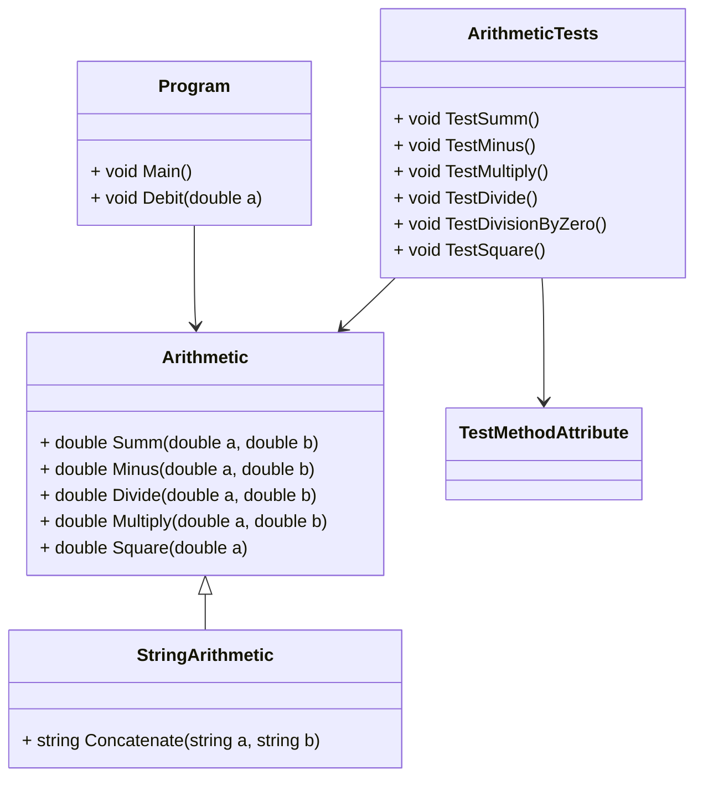

Сделано на коленках, но повозился с пушем

```mermaid
classDiagram
    class Arithmetic {
        + double Summ(double a, double b)
        + double Minus(double a, double b)
        + double Divide(double a, double b)
        + double Multiply(double a, double b)
        + double Square(double a)
    }

    class StringArithmetic {
        + string Concatenate(string a, string b)
    }

    class Program {
        + void Main()
        + void Debit(double a)
    }

    class ArithmeticTests {
        + void TestSumm()
        + void TestMinus()
        + void TestMultiply()
        + void TestDivide()
        + void TestDivisionByZero()
        + void TestSquare()
    }

    class TestMethodAttribute

    Arithmetic <|-- StringArithmetic
    Program --> Arithmetic
    ArithmeticTests --> Arithmetic
    ArithmeticTests --> TestMethodAttribute
```
